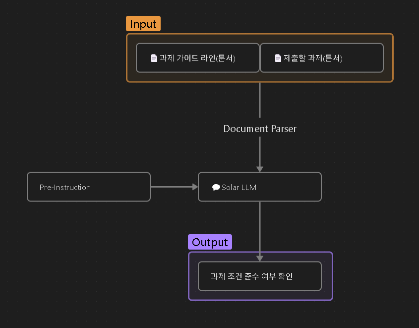

# Completo!
## 🗂️ Presentation Materials
[👉 View Presentation Slides](https://www.canva.com/design/DAGoctCK6vY/mVjrt25BcsVvaDrliRBNbQ/view?utm_content=DAGoctCK6vY&utm_campaign=designshare&utm_medium=link2&utm_source=uniquelinks&utlId=h99d67cfbba)

## 📌 Overview

Completo is an AI-powered document format validation service built on the vision "Complete it, Perfect it, COMPLETO it!". Just as every ingredient is needed to make the perfect hot dog, both content and formatting are essential for a perfect assignment. Our goal is to help students avoid losing points due to minor formatting mistakes and to allow professors to focus on evaluating content.

Completo automatically checks if assignments submitted by students on university servers like PLATO at Pusan National University strictly follow the required template. Before submission, students can check detailed requirements such as file name, extension, and in-document items in real time and correct errors, preventing point deductions from trivial mistakes.

## 🎯 Problem Statement & Expected Benefits

### Problem Definition
- Students often miss or misinterpret assignment submission requirements set by professors, resulting in frequent point deductions.
- Manually checking details such as file name, extension, and specific document formats (e.g., cover page, page limit) is cumbersome and error-prone.
- Graders spend a lot of time pointing out and grading each formatting error, making quick feedback difficult and causing repeated mistakes.

### Importance & Necessity
- Students can prevent unnecessary point deductions and self-check compliance before submission.
- Timely feedback on minor mistakes allows students to correct them, preventing repeated errors due to late or missing feedback.
- Automating repetitive and tedious format checks increases self-directed learning and assignment submission efficiency.

### Expected Benefits
- Students can check compliance in real time before submission, preventing point deductions.
- Integration with assignment submission systems (like PLATO) for automatic format validation and pass/fail notification.
- Immediate feedback blocks format errors in advance, completely removing the grading burden from professors.
- Improved assignment management efficiency across the entire school.

## ✅ Upstage API Usage

- **Upstage Document Parser**: Converts assignment requirements written by professors (in Korean or English) into a format that LLM can understand, and also analyzes and structures the files uploaded by students.
- **Solar LLM**: Based on the extracted requirements, it contextually determines whether the actual submission meets the requirements.

## 🚀 Key Features

- ✨ **Automatic Requirement Parsing & Structuring**
  - The Document Parser automatically parses assignment requirements uploaded by professors (e.g., on PLATO) and extracts detailed conditions specified in the document.
  - **Benefit**: Understands and structures natural language requirements, helping students understand the assignment structure before submission.
  - Supported formats: docx, pdf, etc.

- ✨ **Automated Submission Validation**
  - When students upload files (docx, pdf, etc.), Solar LLM compares the extracted requirements with the actual file and provides real-time feedback on compliance.
  - Examples: cover page presence, name/student ID inclusion, page limit, etc.
  - **Benefit**: Instantly detects errors before submission, preventing point deductions.

- ✨ **Uncertainty Notification**
  - If requirement interpretation is ambiguous, students are notified to double-check, preventing submission errors.

## 🖼️ Demo
- **Scenario**
  - **Before**: Manual format check by professor → **After**: AI automatic validation
  - **Before**: Student realizes mistakes after losing points → **After**: Real-time correction before submission
  - **Before**: Repeated format mistakes → **After**: Prevent mistakes in advance, improve assignment quality

## 🔬 Technical Summary

- **Document Parser(document-parse-250508)**
- **Solar LLM(solar-pro2-preview)**

## 🧰 Tech Stack
- Languages: TypeScript, Python
- Frameworks: React, FastAPI, Vite

### System Architecture


## 🔧 Installation & Usage
### Frontend
- cd frontend
- npm run dev
### Backend
- Set API_KEY in (backend/.env/data.env)
- cd backend
- uvicorn main:app --reload

## 📁 Project Structure
```sh
/
├── frontend                 # Frontend code
│   ├── public/              # Static files
│   ├── src/                 # Source code
│   │   ├── assets/          # Images and other static assets
│   │   ├── components/      # Reusable UI components
│   │   ├── pages/           # Page-level React components
│   │   ├── types/           # TypeScript type definitions
│   │   ├── App.tsx          # Main app file
│   │   ├── index.css        # Global styles
│   │   ├── main.tsx         # React app entry point
│   │   └── vite-env.d.ts    # Vite environment type definitions
│   ├── package.json         # Package settings and dependencies
│   ├── tailwind.config.js   # Tailwind CSS config
│   ├── tsconfig.json        # TypeScript config
│   ├── vite.config.ts       # Vite config file
│   └── index.html           # HTML template
├── backend                  # Backend code
│   ├── .env/                # Environment variable files
│   ├── app/                 # FastAPI application modules
│   │   ├── controllers/     # API controllers
│   │   ├── models/          # Data models and related files
│   │   ├── routes/          # API route definitions
│   │   ├── services/        # Business logic and services
│   ├── temp/                # Temporary file storage
│   └── main.py              # FastAPI application entry point
└── README.md                # Project documentation
```
## 🧑‍🤝‍🧑 Team Members

| Name    | Role     | GitHub                                      |
|---------|----------|---------------------------------------------|
| Sungwoo Jung   |   Leader   | https://github.com/qda-sw    |
| Nayeon An      |   Member   | https://github.com/annaaa4701  |
| Jaewon Jung    |   Member   | https://github.com/wolfura-ark  |
| Seungwoo Lim   |   Member   | https://github.com/ChopinBag  |

## 💡 References & Inspiration

* [Upstage Document Parse](https://www.upstage.ai/products/document-parse)
* [Upstage: Building end-to-end RAG system using Solar LLM and MongoDB Atlas](https://www.upstage.ai/blog/en/building-rag-system-using-solar-llm-and-mongodb-atlas)
* [PLATO Official Documentation](https://plato.pusan.ac.kr)
